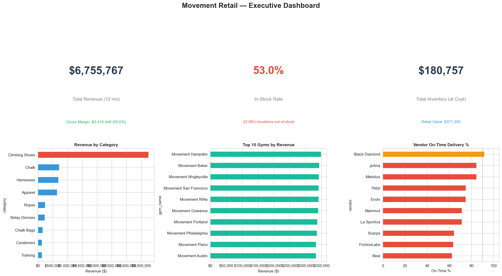
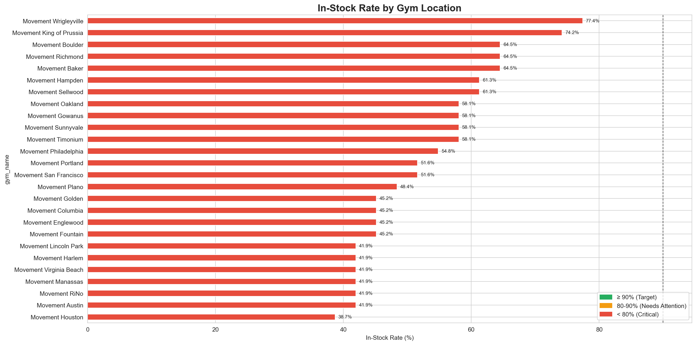
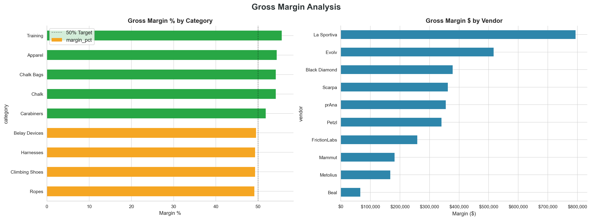
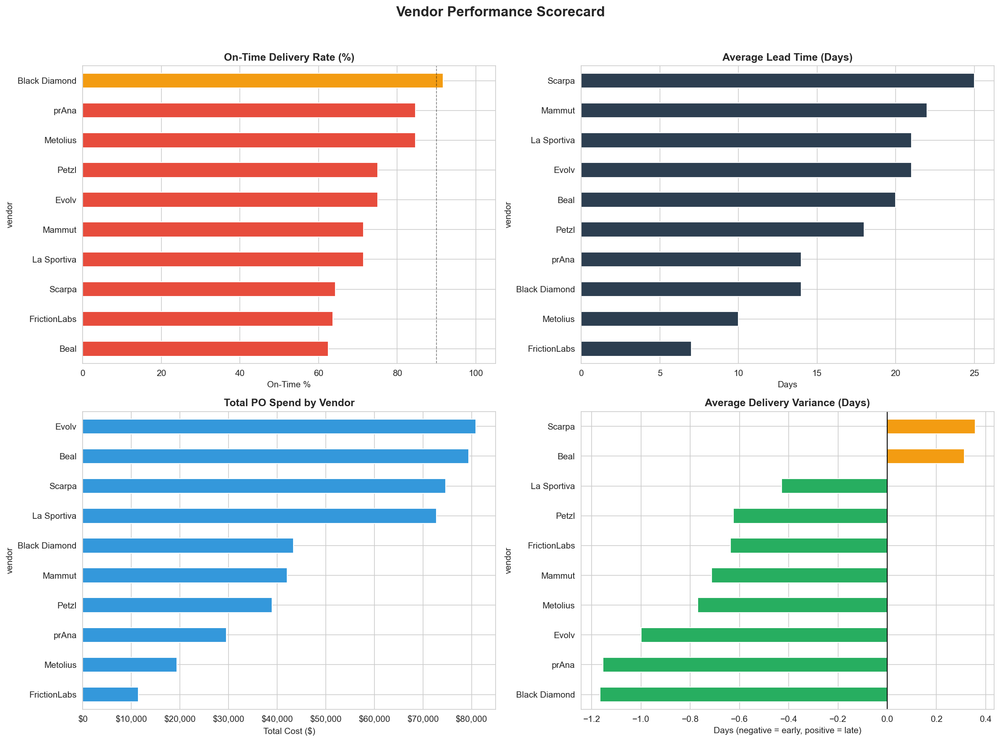

# Retail Buying & Allocation Analysis Dashboard



## 👋 Hi, My name is Peyton Cunningham!


**Thank you for taking the time to review my portfolio project!**

When first reading through the job description for the **Assistant Buyer – Gear & Allocation** position, I immediately knew that this was a chance to bridge the gap between my skills in data analytics, critical thinking, communication, and passion for Movement's vision. I have spent the past weeks creating sample data and scalable code to address the needs of the position.

As a current **Front Desk Supervisor at Movement Golden**, I have a uniquely keen understanding of the operational needs and challenges of our gyms from a first person experience. As an avid climber and current Movement Employee, I have a thorough understanding of the products our members need and want.

In this position I will generate robust metrics that will drive data-driven decisions to ensure the right product is in the right place at the right time across Movement's 30+ gyms.

### The Goals Of This Project

This project showcases how I will approach the core responsibilities outlined in the job description:
- **Inventory & allocation** — tracking in-stock rates, executing weekly allocations, and monitoring aged inventory
- **Sales analysis** — identifying trends, top sellers, and seasonal patterns to inform chase buys and replenishment
- **Vendor management** — tracking purchase orders, on-time delivery, and vendor performance
- **Data-driven insights** — creating clear visualizations that support buying decisions

---

## The Functions Of This Project

This tool analyzes retail data and **produces easy-to-understand reports and charts**. Essentially, it is an automated way to answer questions like:

- *"Which gyms have low in-stock rates that need immediate allocation?"*
- *"What are our top-selling products and highest-margin categories?"*
- *"Which vendors are consistently delivering on time?"*
- *"Where do we have overstock that needs markdowns or transfers?"*

**No technical knowledge required to understand the outputs!** The tool generates visual dashboards and clear reports that any buyer or executive can interpret.

---

## 📊 The Three Areas of Analysis

### 1. Inventory & Allocation Analysis
**What it answers:** Are we sending the right product to the right gyms?

| What I Analyze | Why It Matters |
|----------------|----------------|
| [**In-stock rate by gym**](output/charts/05_instock_by_gym.png) | Ensures strong in-stock levels across 30+ locations, the #1 allocation KPI |
| [**Inventory status overview**](output/charts/06_inventory_status.png) | Shows the health of inventory network-wide (out of stock, low, overstock) |
| [**Aged inventory analysis**](output/charts/07_aged_inventory.png) | Identifies slow-moving and overstock items that tie up capital |
| [**Allocation efficiency**](output/charts/10_allocation_analysis.png) | Compares inventory levels to sales velocity to optimize product flow |



**Sample insight:** *All 30+ gyms are below our target In-Stock Rate of 90%!.*

<details>
<summary><strong>📖 Key Terms</strong></summary>

| Term | Definition | Calculation |
|------|------------|-------------|
| **In-Stock Rate** | Percentage of SKU-locations with inventory available to sell | `SKUs In-Stock / Total SKUs * 100` |
| **Weeks of Supply** | How long current inventory will last at current sales rate | `On-Hand Units / Avg Weekly Sales` |
| **Overstock** | Inventory exceeding 12 weeks of supply — ties up capital | `Weeks of Supply > 12` |
| **SKU-Location** | A unique product at a specific gym (e.g., "Tarantula size 42 at RiNo") | — |

</details>

### 2. Sales Performance Analysis
**What it answers:** What's selling, where, and when?

| What I Analyze | Why It Matters |
|----------------|----------------|
| [**Sales by product category**](output/charts/01_sales_by_category.png) | Shows which categories drive revenue and volume, critical for assortment planning |
| [**Regional sales performance**](output/charts/02_sales_by_region.png) | Compares performance across Movement's geographic regions |
| [**Gross margin analysis**](output/charts/03_margin_analysis.png) | Identifies which categories and vendors deliver the best margins |
| [**Monthly sales trends**](output/charts/04_monthly_trends.png) | Reveals seasonality patterns to inform buying cycles and chase buys |



**Sample insight:** *La Sportiva generated the greatest gross margin over the 12 month period (Feb 2025 - Jan 2026).*

<details>
<summary><strong>📖 Key Terms</strong></summary>

| Term | Definition | Calculation |
|------|------------|-------------|
| **Gross Margin $** | Dollar profit after subtracting product cost | `Revenue - Cost of Goods Sold` |
| **Gross Margin %** | Percentage of revenue kept as profit | `(Revenue - Cost) / Revenue * 100` |
| **Seasonality** | Predictable sales patterns tied to time of year | — |
| **Chase Buy** | Additional order placed mid-season to restock fast sellers | — |

</details>

### 3. Vendor Management & Purchase Orders
**What it answers:** How reliable are our vendors, and is our buying pipeline healthy?

| What I Analyze | Why It Matters |
|----------------|----------------|
| [**Vendor on-time delivery rates**](output/charts/08_vendor_scorecard.png) | Tracks which vendors meet their commitments, critical for maintaining in-stock levels |
| [**Lead time analysis**](output/charts/08_vendor_scorecard.png) | Understanding vendor lead times helps time POs to avoid stockouts |
| [**PO pipeline status**](output/charts/11_po_pipeline.png) | Shows the flow of open, in-transit, and received purchase orders |
| [**Top & bottom sellers**](output/charts/09_top_bottom_sellers.png) | Informs chase buys for winners and markdown decisions for underperformers |



**Sample insight:** *All vendors are below the 92% on time threshold.*

<details>
<summary><strong>📖 Key Terms</strong></summary>

| Term | Definition | Calculation |
|------|------------|-------------|
| **On-Time Delivery (OTD)** | Percentage of POs delivered by the expected date | `On-Time POs / Total POs * 100` |
| **Lead Time** | Days between placing a PO and receiving inventory | `Delivery Date - PO Date` |
| **Delivery Variance** | How many days early or late a shipment arrived | `Actual Delivery - Expected Delivery` |
| **PO (Purchase Order)** | Formal order sent to a vendor for inventory | — |

</details>

---

## 📈 Sample Visualizations

The project **automatically** generates **13 professional charts** that are ready for executive presentations. Here are a few highlights:

### [Executive Dashboard](output/charts/00_executive_dashboard.png)
A one-page summary showing key metrics at a glance: total revenue, in-stock rate, inventory value, sales by category, top gyms, and vendor on-time delivery.

### [In-Stock Rate by Gym](output/charts/05_instock_by_gym.png)
Color-coded bars (red/yellow/green) that instantly show which gyms need allocation attention, the most important weekly view for this role.

### [Gross Margin Analysis](output/charts/03_margin_analysis.png)
Margin percentages by category and margin dollars by vendor, critical for assortment and buying decisions.

### [Vendor Performance Scorecard](output/charts/08_vendor_scorecard.png)
A comprehensive 4-panel view of vendor on-time delivery, lead times, spend, and delivery variance.

### [Climbing Shoe Deep-Dive](output/charts/12_shoe_deep_dive.png)
A category-level analysis of Movement's highest-margin gear category, showing revenue by model, beginner vs. advanced mix, in-stock rates, and monthly trends.

---

## 🔧 How I Built This

I used **Python**, a widely-used programming language for data analysis. The code is thoroughly commented to explain every step, several 1000 lines with **explanations of what each section does and why**.

### Key Technologies
| Tool | What It Does |
|------|--------------|
| **Python** | The programming language that runs everything |
| **pandas** | Handles data manipulation (similar to Excel but more powerful) |
| **matplotlib & seaborn** | Creates the charts and visualizations |
| **NumPy** | Performs mathematical calculations |

### Why These Choices Matter for the Role
- **Business Central compatibility:** The data structures I created mirror what you'd see in ERP/inventory management systems like Business Central
- **Scalability:** This approach can handle thousands of SKUs across 30+ locations
- **Repeatability:** Run the same analysis weekly or monthly with updated data, supporting the weekly and monthly reporting mentioned in the job description
- **Accuracy:** Automated calculations eliminate manual errors in allocation and reporting

---

## 🚀 How to Run This Project

### For Non-Technical Users
The charts and sample outputs are already included in the `output/` folder, you can view them without running any code!

To find this folder, scroll to the top of this page and select **Assistant_Buyer**. Then, select **output** > **charts** > **(any file within this folder)**. There are 13 visualizations generated by the project to look through!

### For Technical Users
If you'd like to run the analysis yourself:

```bash
# 1. Clone the repository
git clone https://github.com/PeytonCunningham720/Assistant-Buyer.git
cd Assistant-Buyer

# 2. Create and activate a virtual environment
python -m venv venv
source venv/bin/activate  # On Windows: venv\Scripts\activate

# 3. Install dependencies
pip install -r requirements.txt

# 4. Run the analysis
python src/main.py
```

The script will generate fresh data, run all analyses, and save outputs to the `output/` folder.

---

## Project Structure

```
retail_analysis/                  # Root project directory
├── output/                       # Folder for all generated outputs
│   ├── charts/                   # PNG visualizations generated by scripts
│   └── data/                     # Exported CSV or other data files
├── src/                          # Source code directory
│   ├── visualizations/             # Folder for all visualization scripts
│   │   ├── __init__.py             # Makes this folder a Python package
│   │   ├── executive_dashboard.py  # Script to create executive dashboard chart
│   │   └── ...                     # Other visualization scripts
│   ├── chart_utils.py            # Helper functions for consistent chart styling
│   ├── config.py                 # Constants, colors, paths, and other configuration
│   ├── data_generator.py         # Functions to generate synthetic or demo data
│   ├── main.py                   # Entry point script to run the analysis
│   ├── summary.py                # Script to generate summary reports
├── .gitignore                    # Tells python which files to ignore
├── README.md                     # This File!
└── requirements.txt              # Python dependencies for the project
```

---

## 💡 Key Retail Buying Concepts Demonstrated

### In-Stock Rate
The in-stock rate measures the percentage of SKU-locations that have product available to sell:
- **Above 90%** = Target — strong availability for members
- **80–90%** = Needs attention — some products are running low
- **Below 80%** = Critical — members are missing products they want to buy

*This is the core metric for the weekly allocation process described in the job description under "execute weekly gear allocations across 30+ gyms."*

### Inventory-to-Sales Ratio
This measures how much inventory you're holding relative to what you're selling:
```
Inventory-to-Sales Ratio = Current Inventory Value / Revenue
```
*A lower ratio means leaner, more efficient inventory. A higher ratio may indicate overstock that needs markdowns or transfers between locations.*

### Vendor On-Time Delivery
Tracking whether vendors deliver when promised is critical for maintaining in-stock levels:
- **Above 92%** = Strong partner
- **85–92%** = Acceptable with room for improvement
- **Below 85%** = Needs vendor follow-up and discussion

*Vendor management is a core responsibility of the Assistant Buyer, "act as the primary contact for vendors regarding PO confirmations, shipping updates, and operational follow-up."*

---

## 🔮 Future Enhancements

If I were to continue developing this project, here's what I'd add:

| Enhancement | Business Value |
|-------------|----------------|
| **Interactive dashboards** | Allow buyers to filter by gym, category, or vendor and explore data themselves |
| **Automated allocation engine** | Calculate optimal weekly allocations based on sales velocity and on-hand inventory |
| **Predictive analytics** | Forecast demand by season and location to support pre-season buying |
| **Business Central integration** | Pull live data directly from Movement's ERP system |
| **Vendor demo scheduling** | Track and coordinate vendor demo events across gyms |

---

## 🤝 Let's Connect!

I'm excited about the opportunity to bring these analytical skills to Movement's retail team. Supporting the buying and allocation process is the kind of detail-oriented, data-driven work that I thrive on, and doing it for a company I believe in as both an employee and a climber makes it even more meaningful.

I'd love to discuss how my skills will support Movement's mission of growth, connection, and integrity.

**Peyton Cunningham**

---

## 📝 A Note on the Data

This project uses **synthetic (fake) data** that I generated to demonstrate my analysis capabilities. No real Movement data was used. The data is designed to be realistic and representative of what you might see in an actual climbing gym retail operation across 30+ locations.

---

*Thank you for reviewing my project! I hope it demonstrates not just my technical abilities, but my understanding of what truly matters in retail buying and allocation: **getting the right gear into the hands of the climbers who need it.***
